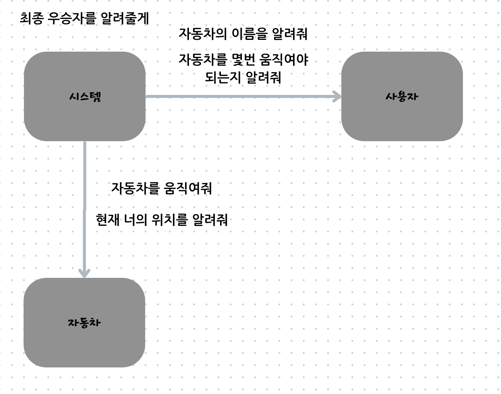

## 요구사항
- 주어진 횟수 동안 n대의 자동차는 전진 또는 멈출 수 있다.
- 각 자동차에 이름을 부여할 수 있다. 전진하는 자동차를 출력할 때 자동차 이름을 같이 출력한다.
- 자동차 이름은 쉼표(,)를 기준으로 구분하며 이름은 5자 이하만 가능하다.
- 사용자는 몇 번의 이동을 할 것인지를 입력할 수 있어야 한다.
- 전진하는 조건은 0에서 9 사이에서 무작위 값을 구한 후 무작위 값이 4 이상일 경우이다.
- 자동차 경주 게임을 완료한 후 누가 우승했는지를 알려준다. 우승자는 한 명 이상일 수 있다.
- 우승자가 여러 명일 경우 쉼표(,)를 이용하여 구분한다.
- 사용자가 잘못된 값을 입력할 경우 IllegalArgumentException을 발생시킨 후 애플리케이션은 종료되어야 한다.

1. 자동차는 전진 또는 멈출 수 있다 -> 움직일 수 있다.
2. 각 자동차에 이름을 부여할 수 있다.
   - 자동차의 이름은 쉼표를 기준으로 구분하며 이름은 5자 이하만 가능하다.
3. 몇번의 이동을 할 것인지 입력해야한다.
4. 0~9까지 무작위 값을 구한다.
5. 무작위 값이 4이상인 경우 전진한다. -> 판단
6. 자동차 경주 게임을 완료한 후 누가 우승했는지 알려준다. -> 판단

## 유스케이스
1. 사용자는 n대의 자동차 이름을 정한다.
   - 이 때 자동차의 이름은 쉼표를 기준으로 구분하며 이름을 5자 이하만 가능하다. 
2. 사용자에게 입력받은 이름으로 자동차를 생성한다.
3. 사용자는 몇 번의 이동을 할 것인지를 정한다.
   - 전진 조건은 0~9사이에 무작위 값을 구한 후 무작위 값이 4이상인 경우이다.
4. 자동차 경주 게임을 완료한 후 누가 우승했는지를 알려준다. 우승자는 한 명 이상일 수 있다.
   - 우승자가 여럿인 경우 쉼표를 이용하여 구분한다.

#### 아 진짜 이게 관리한다라는게 너무 애매하다; 게임 흐름을 관리한다로하면 모든걸 다 할 수 있네;;

## 책임
- `Player`는 시스템이 요청하는 행위를 대답하는 책임 (자동차의 이름정하기, 몇번 이동할 것인지 정하기)
- `CarFactory`는 차를 생성하는 책임
- `Judgement`는 우승자를 알려주는 책임

3. 시스템은 사용자에게 받은 이름을 토대로 자동차를 생성한다. -> 자동차를 생성한다.
4. 시스템은 사용자에게 자동차가 움직일 횟수를 요청한다. -> 사용자는 움직일 횟수를 정한다.
5. 사용자는 자동차가 움직일 횟수를 시스템에게 응답한다.
6. 시스템은 각 자동차에게 입력된 횟수만큼 이동을 요청한다.
7. 자동차는 무작위 값이 4이상인 경우 전진하고, 그렇지 않으면 멈춘다.
8. 시스템은 최종 우승자를 알려준다.

## Domain
1. `User` - 사용자
2. `System` - 시스템
3. `Car` - 자동차
4. `Move` - 움직임(인터페이스)
   - `Go`
   - `Stop`
5. `MoveStrategy` - 움직임의 조건(인터페이스
    - `RandomMoveStrategy`
    - `FixedMoveStrategy`
6. `Position` - 현재 위치

## 첵임
1. 사용자는 시스템에게 자동차의 이름을 응답할 책임이 있다.
2. 사용자는 시스템에게 자동차가 움직일 횟수를 응답할 책임이 있다.
3. 자동차는 움직일 책임이 있다.
4. 자동차는 현재

2. 시도할 횟수를 입력할 책임
3. 자동차를 시도할 횟수만큼 움직일 책임
4. 우승자를 출력할 책임
5. 자동차를 움직이는 책ㅇ

